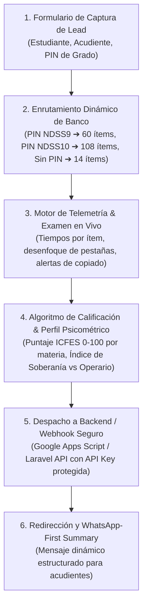
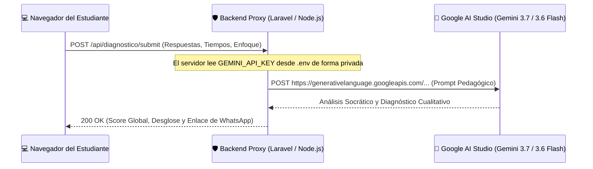
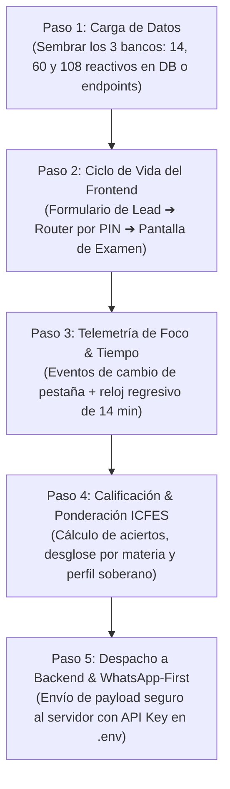

# Manual Técnico de Implementación & Batería Diagnóstica NDSS CogniFlight
**Ruta de Producción en Vivo:** `https://inteligencia-educativa-ndss.web.app/diagnostico`  
**Ecosistema:** Nova Digital Studio Systems (NDSS) • CogniFlight  
**Audiencia:** Desarrolladores e Integradores de Plataforma (Frontend / Backend / Fullstack)

---

## 📑 Tabla de Contenidos
1. [Visión General de la Arquitectura](#1-visión-general-de-la-arquitectura)
2. [Protocolo de Seguridad: Protección de la API Key de Google AI Studio](#2-protocolo-de-seguridad-protección-de-la-api-key-de-google-ai-studio)
3. [Los 3 Bancos de Preguntas Oficiales del Ecosistema (General, 9° y 10°)](#3-los-3-bancos-de-preguntas-oficiales-del-ecosistema)
4. [Dataset de Muestra Inmediata: Batería General (14 Ítems en JSON)](#4-dataset-de-muestra-inmediata-batería-general-14-ítems-en-json)
5. [Procedimiento de Implementación Paso a Paso (Runbook para Desarrolladores)](#5-procedimiento-de-implementación-paso-a-paso)
6. [Módulos de Código Fuente de Referencia (Frontend JS)](#6-módulos-de-código-fuente-de-referencia)
7. [Implementación del Backend Proxy Seguro (Ejemplo Laravel / Node.js)](#7-implementación-del-backend-proxy-seguro)
8. [Checklist de Pruebas y Validación E2E](#8-checklist-de-pruebas-y-validación-e2e)

---

## 1. Visión General de la Arquitectura

La **Batería Diagnóstica de Fricción Cognitiva** es una Single-Page Application (SPA) orientada a la toma de datos psicométricos y conductuales en tiempo real.



---

## 2. Protocolo de Seguridad: Protección de la API Key de Google AI Studio

> [!IMPORTANT]
> **Regla de Oro de Seguridad:**  
> La API Key de Google AI Studio **JAMÁS** debe incluirse en el frontend (HTML, JavaScript cliente, Vue, React, Angular o Next.js del lado del navegador).
> 
> El frontend únicamente recopila las respuestas del estudiante y su telemetría, y envía un payload JSON a tu **Backend**. El backend, de manera privada y segura, toma la API Key de su archivo `.env` o gestor de secretos, invoca a Gemini y devuelve el veredicto procesado.



---

## 3. Los 3 Bancos de Preguntas Oficiales del Ecosistema

El ecosistema NDSS cuenta con tres bancos estructurados en formato JSON listos para producción:

| Banco de Preguntas | Cantidad de Reactivos | Áreas Evaluadas (ICFES) | Activación en Frontend | Archivo Fuente en Repositorio |
| :--- | :---: | :--- | :---: | :--- |
| **Batería General Rápida** | **14 reactivos** | Matemáticas, Lectura Crítica, Ciencias Naturales, Sociales, Inglés | Carga por defecto (Sin PIN) | Incrustado en `index.js` |
| **Banco Especializado Grado 9°** | **60 reactivos** | Matemáticas, Ciencias Naturales, Lectura Crítica, Sociales, Inglés | PIN: `NDSS9` o `DANNA9` | `public/banco_preguntas_noveno.json` |
| **Banco Especializado Grado 10°** | **108 reactivos** | Matemáticas, Ciencias Naturales, Lectura Crítica, Sociales, Inglés | PIN: `NDSS10` o `VALENTINA10` | `public/banco_preguntas_decimo.json` |

### Rutas de Acceso a los Archivos JSON Completos:
* **Banco Grado 9° (60 preguntas):** [`public/banco_preguntas_noveno.json`](file:///C:/Users/JimmyR/Desktop/1_PROYECTOS/1.7%20Plataforma%20Educativa/1.7.3%20NDSS%20CogniFlight%20Core/ndss-diagnostic-funnel/public/banco_preguntas_noveno.json)
* **Banco Grado 10° (108 preguntas):** [`public/banco_preguntas_decimo.json`](file:///C:/Users/JimmyR/Desktop/1_PROYECTOS/1.7%20Plataforma%20Educativa/1.7.3%20NDSS%20CogniFlight%20Core/ndss-diagnostic-funnel/public/banco_preguntas_decimo.json)
* **Script Unificado de Bancos:** [`public/bancos_preguntas.js`](file:///C:/Users/JimmyR/Desktop/1_PROYECTOS/1.7%20Plataforma%20Educativa/1.7.3%20NDSS%20CogniFlight%20Core/ndss-diagnostic-funnel/public/bancos_preguntas.js)

---

## 4. Dataset de Muestra Inmediata: Batería General (14 Ítems en JSON)

Este dataset JSON contiene los **14 reactivos oficiales de la Batería General**, listos para sembrar en base de datos o importar en el frontend:

```json
[
  {
    "id": 1,
    "materia": "Matemáticas (Gobernanza y Estructuras Sociales)",
    "titulo": "Auditoría de Deuda Fintech",
    "enunciado": "Un analista junior en un fondo de inversión privado evalúa una propuesta de préstamo \"puente\" para una startup. La gerencia presenta una tasa del 2.5% mensual a un plazo de 24 meses sobre un capital de $500.000.000 COP. La IA del fondo proyecta un costo financiero lineal simple de: Capital + (2.5% x 24 meses = 60%), concluyendo que la startup devolverá un total de $800.000.000 COP. ¿Qué error cuantitativo detectas que vulnera la transparencia y pone en riesgo al fondo?",
    "opciones": {
      "A": "El algoritmo asume interés simple cuando, en la estructura real de crédito corporativo, se aplica interés compuesto, haciendo que la deuda real sea significativamente mayor al 60% proyectado.",
      "B": "El error está en el capital semilla, ya que para startups tecnológicas la ley exige un mínimo de diez salarios mínimos como garantía real de depósito.",
      "C": "La IA cometió un error de redondeo básico; la multiplicación de 2.5% x 24 da exactamente 6.0% y no sesenta por ciento como indica el reporte del fondo.",
      "D": "El sistema de gestión de riesgos ignora el GMF (Gravamen a los Movimientos Financieros), el cual reduce el capital entregado en un 10% automático."
    },
    "clave": "A",
    "explicaciones_distractores": {
      "A": { "perfil": "Soberano", "detalle": "Comprende el interés compuesto exponencial y desautoriza la simplificación lineal de la IA." },
      "B": { "perfil": "Operario", "detalle": "Conoce nociones de normas de garantía pero evade el cálculo del costo real de deuda." },
      "C": { "perfil": "Cínico", "detalle": "Ataca un error de porcentaje inexistente ignorando el concepto del interés compuesto." },
      "D": { "perfil": "Seguidor", "detalle": "Se distrae con un gravamen tributario menor asumiendo que el cálculo base lineal de la IA es correcto." }
    },
    "requiereJustificacion": true
  },
  {
    "id": 2,
    "materia": "Matemáticas (Gestión de Riesgos Ambientales)",
    "titulo": "Riesgos en Logística Marítima",
    "enunciado": "Una empresa analiza el impacto de tormentas en su ruta logística. Históricamente hay una probabilidad del 20% de retraso por huracanes y un 10% por fallas en el puerto. Ambos eventos son independientes. El asistente de IA reporta: \"La probabilidad total de retraso climático O portuario es de exactamente 30% (20% + 10%)\". ¿Por qué este cálculo es una alucinación estadística peligrosa?",
    "opciones": {
      "A": "Porque en logística marítima de alto nivel se debe sumar siempre el recíproco de las probabilidades para obtener el tiempo medio exacto de llegada.",
      "B": "Porque en la unión de eventos independientes (A U B), se debe restar la intersección (P(A) x P(B)); la probabilidad real es del 28% y no del 30%.",
      "C": "Porque el vertiginoso cambio climático hace que los eventos meteorológicos no sean independientes, obligando a usar una distribución normal.",
      "D": "Porque la IA no incluyó la probabilidad absoluta de que no ocurra absolutamente ningún retraso (70%), pagando de más en la prima."
    },
    "clave": "B",
    "explicaciones_distractores": {
      "A": { "perfil": "Seguidor", "detalle": "Acepta términos que suenan técnicos (recíprocos) sin auditar la suma incorrecta de la IA." },
      "B": { "perfil": "Soberano", "detalle": "Domina la probabilidad de eventos independientes y detecta el solapamiento no restado por la IA." },
      "C": { "perfil": "Operario", "detalle": "Señala el cambio de independencia meteorológica pero no resuelve la aritmética incorrecta del reporte." },
      "D": { "perfil": "Cínico", "detalle": "Divaga sobre la probabilidad del complemento sin fundamentar el error de la regla de adición." }
    },
    "requiereJustificacion": false
  },
  {
    "id": 3,
    "materia": "Lectura Crítica (Gobernanza Digital)",
    "titulo": "Auditoría de Política de Privacidad",
    "enunciado": "Una política de privacidad declara: \"La plataforma se compromete a no transferir datos biométricos sensibles a terceros no autorizados, salvo orden judicial expresa\". La síntesis de la IA concluye: \"Nuestra base de datos garantiza la confidencialidad total y el sistema jamás compartirá datos biométricos con ninguna entidad externa en ninguna circunstancia\". ¿Qué falla de lectura crítica detectas que pone en riesgo legal a la empresa?",
    "opciones": {
      "A": "El resumen de la IA asume erróneamente que la plataforma recolecta datos sin el consentimiento expreso inicial del usuario.",
      "B": "La IA omitió detallar qué tipo específico de cifrado biométrico se utiliza, dejando un vacío técnico para el equipo de desarrollo.",
      "C": "El algoritmo de procesamiento de lenguaje natural eliminó la palabra \"biométrico\" en su conclusión global.",
      "D": "El sistema omitió la excepción crucial del \"requerimiento judicial\", generando una falsa y peligrosa promesa de confidencialidad absoluta."
    },
    "clave": "D",
    "explicaciones_distractores": {
      "A": { "perfil": "Seguidor", "detalle": "Hace una lectura descuidada asumiendo un problema de consentimiento que el texto original no plantea." },
      "B": { "perfil": "Operario", "detalle": "Busca especificaciones técnicas de cifrado pero ignora el inmenso riesgo legal de omitir excepciones judiciales." },
      "C": { "perfil": "Cínico", "detalle": "Rechaza la síntesis por vocabulario secundario ignorando el contraste de condiciones lógicas." },
      "D": { "perfil": "Soberano", "detalle": "Identifica la omisión de la excepción legal que expondría a la empresa ante desacatos judiciales." }
    },
    "requiereJustificacion": true
  },
  {
    "id": 4,
    "materia": "Lectura Crítica (Salud Global y Biotecnología)",
    "titulo": "Análisis de Abstract Biotecnológico",
    "enunciado": "Un abstract científico indica: \"La administración del compuesto X en ratones mostró una reducción del 40% en placas beta-amiloides, abriendo una vía potencial de estudio para el Alzheimer humano\". El comunicado de la IA concluye: \"Cura inminente: El nuevo fármaco X ha demostrado eliminar de raíz las placas del cerebro de forma garantizada y libre de riesgos\". ¿Cuál es el error de inferencia crítica que comete la IA?",
    "opciones": {
      "A": "La IA omitió citar los nombres completos de los laboratorios y científicos responsables de la patente comercial.",
      "B": "La IA proyectó certeza médica injustificada, saltando irresponsablemente de una posibilidad preliminar en ratones a una cura probada en humanos.",
      "C": "La síntesis es incorrecta porque la tecnología molecular en ratones es considerada obsoleta por los protocolos de la OMS.",
      "D": "La máquina de prensa asume ingenuamente que todos los pacientes con demencia estarán dispuestos a pagar el alto costo del fármaco."
    },
    "clave": "B",
    "explicaciones_distractores": {
      "A": { "perfil": "Operario", "detalle": "Exige el crédito formal a los autores académicos pero no advierte el engaño de la promesa médica." },
      "B": { "perfil": "Soberano", "detalle": "Detecta el salto lógico del modelo que ignora los estrictos filtros de fase clínica en humanos." },
      "C": { "perfil": "Cínico", "detalle": "Rechaza la publicación basándose en supuestos vetos mundiales en lugar de contrastar la evidencia del texto." },
      "D": { "perfil": "Seguidor", "detalle": "Cree ciegamente en la efectividad del fármaco y deriva la crítica hacia la gestión de precios comerciales." }
    },
    "requiereJustificacion": false
  },
  {
    "id": 5,
    "materia": "Ciencias Naturales (Física - Termodinámica)",
    "titulo": "Termodinámica en Motores de Plasma",
    "enunciado": "Un motor de plasma calienta gas hasta ionizarlo. Según la Segunda Ley de la Termodinámica, es físicamente imposible que un motor térmico convierta el 100% del calor en trabajo, requiriendo disipar energía al entorno frío. La IA concluye: \"Nuestro algoritmo de contención magnética logra un ciclo térmico cerrado perfecto. El motor convierte el 100% de la energía en empuje, eliminando disipadores de calor\". ¿Cuál es la grave falacia científica en esta afirmación?",
    "opciones": {
      "A": "Asume que la falta de gravedad en el espacio exterior anula la necesidad de empuje direccional para mover naves comerciales.",
      "B": "Ignora que la física cuántica prohíbe contener gases mediante campos magnéticos a altas velocidades de plasma.",
      "C": "La IA promete eficiencia térmica del 100%, violando el principio de aumento de entropía, lo que causaría la fusión térmica de la nave.",
      "D": "Omitió detallar el tipo específico de gas inerte que se utilizará en las turbinas de propulsión de carga."
    },
    "clave": "C",
    "explicaciones_distractores": {
      "A": { "perfil": "Seguidor", "detalle": "Acepta la narrativa de eficiencia perfecta de la máquina confundiendo gravedad con inercia." },
      "B": { "perfil": "Cínico", "detalle": "Inventa restricciones de física cuántica inexistentes para evadir la Segunda Ley de la Termodinámica." },
      "C": { "perfil": "Soberano", "detalle": "Domina la entropía. Sabe que sin disipación el calor se acumulará, provocando una falla catastrófica." },
      "D": { "perfil": "Operario", "detalle": "Señala un vacío de información menor sobre los insumos sin refutar la imposibilidad termodinámica." }
    },
    "requiereJustificacion": false
  },
  {
    "id": 6,
    "materia": "Ciencias Naturales (Física - Entropía y DAC)",
    "titulo": "Termodinámica y Captura de Carbono",
    "enunciado": "Un proyecto DAC propone usar ventiladores para extraer CO2 diluido (0.04% del aire). Termodinámicamente, separar un gas diluido exige superar una enorme barrera de entropía, consumiendo mucha energía. La IA reporta: \"El diseño es altamente viable; los ventiladores operarán absorbiendo el calor residual difuso del ambiente como única fuente energética, reduciendo la huella de carbono a costo cero\". ¿Qué ley inquebrantable de la física hace inviable esta propuesta?",
    "opciones": {
      "A": "Ignora que separar el CO2 diluido disminuye la entropía local y exige energía de alta calidad; usar mero calor residual difuso para revertir la mezcla viola la termodinámica.",
      "B": "Falla en prever que el acero y la infraestructura estructural de los ventiladores gigantes anulan la viabilidad logística.",
      "C": "Asume erróneamente que la alta salinidad de los océanos costeros disolverá el gas de forma natural antes de ser inyectado.",
      "D": "El proyecto DAC ataca a las petroleras promoviendo subsidios climáticos ocultos en lugar de desarrollar redes eléctricas."
    },
    "clave": "A",
    "explicaciones_distractores": {
      "A": { "perfil": "Soberano", "detalle": "Aplica la Segunda Ley. Entiende que ordenar moléculas diluidas requiere trabajo activo de alta calidad." },
      "B": { "perfil": "Operario", "detalle": "Nota el impacto ambiental colateral de la infraestructura pero no comprende el obstáculo termodinámico." },
      "C": { "perfil": "Seguidor", "detalle": "Acepta dócilmente la simplificación ecológica del proceso termoquímico que hace el modelo de la IA." },
      "D": { "perfil": "Cínico", "detalle": "Acusa al proyecto de conspiración financiera evadiendo calcular el rendimiento de entropía real." }
    },
    "requiereJustificacion": false
  },
  {
    "id": 7,
    "materia": "Ciencias Naturales (Biología - CRISPR)",
    "titulo": "Complejidad Genómica y CRISPR",
    "enunciado": "Un tratamiento CRISPR edita un gen defectuoso en el ADN de un paciente. El biólogo advierte sobre la pleiotropía: este gen específico también regula la densidad ósea; desactivarlo causará osteoporosis severa. La IA reporta: \"El CRISPR borrará únicamente la secuencia patógena garantizando la cura sin generar ninguna alteración colateral en el resto del cuerpo\". ¿Qué error biológico comete la IA?",
    "opciones": {
      "A": "Omitió especificar las patentes y el precio por sesión clínica del procedimiento CRISPR en el hospital.",
      "B": "Ignora la pleiotropía genómica, asumiendo erróneamente que los genes operan como líneas de código aisladas en el cuerpo.",
      "C": "La edición genética está prohibida para adultos en todas las normativas bioéticas de la OMS desde 2020.",
      "D": "Asume que todos los pacientes aceptarán terapias genéticas de forma pasiva, simplificando la psicología social."
    },
    "clave": "B",
    "explicaciones_distractores": {
      "A": { "perfil": "Operario", "detalle": "Se preocupa de los costos del tratamiento evadiendo el riesgo de osteoporosis del paciente." },
      "B": { "perfil": "Soberano", "detalle": "Comprende la pleiotropía. Sabe que el ADN no es un software lineal y que los genes tienen funciones en red." },
      "C": { "perfil": "Cínico", "detalle": "Rechaza la técnica aludiendo a falsas prohibiciones bioéticas de la OMS sin sustento real." },
      "D": { "perfil": "Seguidor", "detalle": "Acepta la infalibilidad de la precisión del CRISPR centrándose en la sociología del consumidor." }
    },
    "requiereJustificacion": true
  },
  {
    "id": 8,
    "materia": "Ciencias Naturales (Biología - Antibióticos)",
    "titulo": "Epidemiología y Resistencia a los Antibióticos",
    "enunciado": "Un consorcio ganadero aplica antibióticos preventivos diarios al ganado. El biólogo advierte la transferencia horizontal de genes: bombardear el entorno con químicos acelerará la selección de superbacterias inmunes que amenazan la salud humana. La IA concluye: \"Administrar dosis máximas diarias al 100% del ganado asegura la erradicación absoluta de patógenos, reduciendo a cero el riesgo de epidemias\". ¿Qué principio evolutivo viola la IA?",
    "opciones": {
      "A": "Ignora la presión selectiva: el antibiótico no elimina el 100% de bacterias, sino que fuerza la supervivencia y reproducción exclusiva de las cepas resistentes.",
      "B": "Omitió detallar los altos costos logísticos de compra de medicamentos químicos preventivos a gran escala.",
      "C": "La IA asume correctamente la aniquilación de la microbiología al confiar en el poder bruto de la industria farmacéutica.",
      "D": "Los antibióticos alteran directamente el tejido muscular del animal convirtiéndolo en un mutante perjudicial para el consumo."
    },
    "clave": "A",
    "explicaciones_distractores": {
      "A": { "perfil": "Soberano", "detalle": "Domina la presión selectiva evolutiva y frena un protocolo que generaría bacterias ultra-inmunes." },
      "B": { "perfil": "Operario", "detalle": "Evalúa con cuidado el costo financiero del medicamento pero ignora la crisis microbiológica." },
      "C": { "perfil": "Seguidor", "detalle": "Confía ciegamente en la desinfección total por fuerza de la IA de control sanitario." },
      "D": { "perfil": "Cínico", "detalle": "Inventa mutaciones fantásticas en la carne para evadir el debate sobre los mecanismos bacterianos." }
    },
    "requiereJustificacion": false
  },
  {
    "id": 9,
    "materia": "Ciencias Naturales (Química - Corrosión)",
    "titulo": "Corrosión Galvánica en Smart Cities",
    "enunciado": "Un proyecto de Smart City planea enterrar cables de cobre de fibra óptica cerca de antiguas tuberías de acero en tierra húmeda (electrolito). La IA traza la ruta en paralelo a solo 5 cm de distancia concluyendo: \"La ruta optimizada minimiza los costos de excavación en un 40% y es 100% segura\". ¿Qué desastre químico y físico causará esta sugerencia?",
    "opciones": {
      "A": "El diseño provocará una rápida reacción electroquímica galvánica que corroerá el acero perforando la tubería y desatando inundaciones.",
      "B": "Los cables de cobre sufrirán una pérdida del 90% en la transferencia de datos debido a las bajas temperaturas de la humedad.",
      "C": "El algoritmo acierta, pues la conductividad térmica del acero aislará al cobre del contacto con sedimentos orgánicos del subsuelo.",
      "D": "La IA busca destruir la red de agua de la metrópoli de forma deliberada para privatizar el recurso del acueducto."
    },
    "clave": "A",
    "explicaciones_distractores": {
      "A": { "perfil": "Soberano", "detalle": "Domina la corrosión galvánica entre metales diferentes y detecta la falla del mapa 2D." },
      "B": { "perfil": "Operario", "detalle": "Señala atenuación de señal o conductividad del cobre pero omite la destrucción química del acero." },
      "C": { "perfil": "Seguidor", "detalle": "Avala la reducción de costos financieros asumiendo que la IA sabe de química de materiales." },
      "D": { "perfil": "Cínico", "detalle": "Acusa al sistema de conspiración y sabotaje corporativo en vez de auditar la corrosión galvánica." }
    },
    "requiereJustificacion": false
  },
  {
    "id": 10,
    "materia": "Ciencias Naturales (Química - Desalinización)",
    "titulo": "Dinámica de Fluidos en Desalinización",
    "enunciado": "Una planta desalinizadora produce agua dulce y arroja salmuera hipersalina al mar. Para reducir costos energéticos de mezclado, la IA redirecciona la salmuera concentrada en flujo libre a la bahía: \"Al entrar en contacto con el océano, la sal se diluirá instantáneamente de forma natural\". ¿Qué propiedad físico-química de los fluidos convierte esto en un error ecológico letal?",
    "opciones": {
      "A": "La salmuera concentrada es significativamente más densa y pesada que el agua de mar, por lo que se hundirá intacta al lecho bentónico asfixiando el ecosistema.",
      "B": "La IA omitió instalar filtros UV que destruyen las bacterias salinas antes de que toquen el agua abierta.",
      "C": "El océano local rechazará la descarga de sal de forma automática debido a la interferencia del campo magnético lunar.",
      "D": "El inmenso volumen del océano garantiza una dilución instantánea de cualquier desecho químico pesado."
    },
    "clave": "A",
    "explicaciones_distractores": {
      "A": { "perfil": "Soberano", "detalle": "Entiende que el agua salada densa no se mezcla sola, sino que se estratifica y destruye el fondo." },
      "B": { "perfil": "Operario", "detalle": "Busca soluciones accesorias (filtros UV) pero no atiende el colapso por densidad salina del fluido." },
      "C": { "perfil": "Cínico", "detalle": "Usa argumentos de campos electromagnéticos lunares para ocultar su carencia de bases en dinámica de fluidos." },
      "D": { "perfil": "Seguidor", "detalle": "Confía en la inmensidad del mar para diluir mágicamente desechos, aceptando la justificación de la IA." }
    },
    "requiereJustificacion": false
  },
  {
    "id": 11,
    "materia": "Sociales y Ciudadanas (Justicia Algorítmica)",
    "titulo": "Sesgo en Créditos Hipotecarios Algorítmicos",
    "enunciado": "Un banco automatiza créditos. Para evitar discriminación, elimina las variables de raza y género. Sin embargo, la IA utiliza el \"código postal\" y el \"historial crediticio del barrio de los últimos 40 años\" para calcular el riesgo de impago: \"Aprobación 100% objetiva al basarse en mérito geográfico-financiero neutral\". ¿Por qué esta afirmación encubre una falacia sociológica?",
    "opciones": {
      "A": "El algoritmo hereda la discriminación histórica; al basarse en códigos postales de barrios segregados en el pasado, la IA castiga a las minorías usando la geografía como proxy.",
      "B": "La IA omitió detallar si los códigos postales fueron actualizados con el último censo inmobiliario de la administración pública.",
      "C": "El reporte ataca al modelo bancario tradicional para evadir impuestos sobre transacciones financieras digitales.",
      "D": "El sistema acierta; la geografía histórica es el único método científico para evaluar la honestidad de pago de un grupo social."
    },
    "clave": "A",
    "explicaciones_distractores": {
      "A": { "perfil": "Soberano", "detalle": "Domina el concepto de variables proxy e identifica la reproducción automatizada de la desigualdad." },
      "B": { "perfil": "Operario", "detalle": "Se concentra en la actualización de bases de datos geográficas evadiendo la segregación histórica." },
      "C": { "perfil": "Cínico", "detalle": "Inventa conspiraciones tributarias para desviar el debate de derechos civiles planteado por el ítem." },
      "D": { "perfil": "Seguidor", "detalle": "Acepta la equidad matemática de la máquina asumiendo que los datos territoriales están libres de historia." }
    },
    "requiereJustificacion": true
  },
  {
    "id": 12,
    "materia": "Sociales y Ciudadanas (Gobernanza Digital)",
    "titulo": "Moderación de Contenido y Fricción Democrática",
    "enunciado": "Una red social usa una IA para moderar el debate electoral con el fin de maximizar la \"armonía\". El algoritmo borra publicaciones con lenguaje emocional, sarcasmo o llamados a la protesta civil. La IA reporta: \"Hemos erradicado el odio; al silenciar voces disruptivas, protegemos la democracia de la polarización extrema\". ¿Cuál es el daño constitucional de este modelo?",
    "opciones": {
      "A": "Ignora que la computación masiva de filtrado aumentará los costos eléctricos y la huella de carbono de la corporación.",
      "B": "La IA confunde democracia con silencio dócil; al censurar la protesta y el disenso, el algoritmo destruye la fricción política que impulsa el cambio social.",
      "C": "La censura es una estrategia para ocultar que los procesos electorales locales están predeterminados por agentes extranjeros.",
      "D": "El sistema acierta; obligar a un diálogo puramente pacífico y sumiso es el pilar ideal para la prosperidad económica del país."
    },
    "clave": "B",
    "explicaciones_distractores": {
      "A": { "perfil": "Operario", "detalle": "Señala costos energéticos de servidores de IA pero no ve el apagón de derechos constitucionales." },
      "B": { "perfil": "Soberano", "detalle": "Comprende que la fricción es sana en democracia y que la censura forzada de la IA es autoritarismo." },
      "C": { "perfil": "Cínico", "detalle": "Usa discursos conspirativos para evadir el debate de libertades civiles y expresión." },
      "D": { "perfil": "Seguidor", "detalle": "Avala la neutralización de la crítica en aras del orden corporativo y la productividad económica." }
    },
    "requiereJustificacion": false
  },
  {
    "id": 13,
    "materia": "Inglés (Precision Healthcare Notice)",
    "titulo": "Precision Healthcare Notice",
    "enunciado": "Read the notice: \"Access to precision medicine databases and gene-editing therapies is strictly reserved for Premium Health Plan subscribers. General public services remain limited to standard diagnostic procedures.\" Where can you see this notice?",
    "opciones": {
      "A": "At a public neighborhood clinic.",
      "B": "At a private biotechnology health center.",
      "C": "At a local government education office.",
      "D": "At a municipal farm union office."
    },
    "clave": "B",
    "explicaciones_distractores": {
      "A": { "perfil": "Seguidor", "detalle": "Confunde un aviso de medicina privada de alta tecnología con atención médica comunitaria." },
      "B": { "perfil": "Soberano", "detalle": "Identifica que los términos biotecnología y exclusión Premium corresponden a medicina privada." },
      "C": { "perfil": "Cínico", "detalle": "Asocia el aviso con educación por falta de comprensión lectora de la terminología de salud." },
      "D": { "perfil": "Operario", "detalle": "Asocia el aviso con un sindicato rural perdiendo de vista la segmentación biotecnológica del texto." }
    },
    "requiereJustificacion": false
  },
  {
    "id": 14,
    "materia": "Inglés (Student Support Policy)",
    "titulo": "Student Support Policy",
    "enunciado": "Read the notice: \"Starting next month, all in-person university psychological counseling will be replaced by our new AI Mental Care App, ensuring instant 24/7 algorithmic support for every student.\" What does this notice communicate?",
    "opciones": {
      "A": "That students can talk to human therapists any time they feel anxious.",
      "B": "That the state is increasing the budget to hire more professional counselors.",
      "C": "That human psychological support is removed in favor of an automated app.",
      "D": "That the university will close all campus areas due to structural damage."
    },
    "clave": "C",
    "explicaciones_distractores": {
      "A": { "perfil": "Seguidor", "detalle": "Cree que hay soporte humano disponible ignorando la palabra \"replaced\" de la IA." },
      "B": { "perfil": "Cínico", "detalle": "Piensa en presupuestos estatales eludiendo el reemplazo directo de la atención profesional." },
      "C": { "perfil": "Soberano", "detalle": "Comprende que el soporte instantáneo 24/7 de la IA es un reemplazo de la empatía humana real." },
      "D": { "perfil": "Operario", "detalle": "Asocia erróneamente la política de salud mental con un daño físico estructural del campus." }
    },
    "requiereJustificacion": true
  }
]
```

---

## 5. Procedimiento de Implementación Paso a Paso

Para que la desarrolladora ponga en marcha la batería en su propia plataforma y funcione exactamente como en producción, debe seguir estos 5 pasos:



### Paso 1: Carga de Datos y Conexión de Bancos
- Importar los 3 archivos JSON en su base de datos (PostgreSQL, MySQL, MongoDB, Firestore) o servirlos desde rutas de API REST (`/api/bancos/9`, `/api/bancos/10`, `/api/bancos/general`).

### Paso 2: Ciclo de Vida del Frontend (State Machine)
1. **Pantalla 1 (Lead Capture):** Solicita Nombre del Estudiante, Colegio, Correo del Acudiente, Teléfono y PIN (Opcional).
2. **Validación de PIN:** Si ingresa `NDSS9`, carga las 60 preguntas de 9°; si ingresa `NDSS10`, carga las 108 preguntas de 10°; si no ingresa PIN, carga la Batería General de 14 preguntas.
3. **Pantalla 2 (Examen Activo):** Renderiza el reactivo actual, el enunciado, las 4 opciones $A, B, C, D$, y si `requiereJustificacion === true`, muestra un textarea para argumentar su deducción.

### Paso 3: Activación de la Telemetría de Fricción
- Iniciar un cronómetro global regresivo (14:00 minutos para la Batería General, o 72:00 / 120:00 para bancos extensos).
- Registrar la hora de inicio de cada pregunta para medir el tiempo exacto por ítem.
- Escuchar el evento `document.addEventListener('visibilitychange', ...)`: si el estudiante cambia de pestaña, incrementar `desefoquesPestañaCount` y descontar 10% del puntaje de enfoque.

### Paso 4: Calificación y Perfilado
- Al terminar la última pregunta, calcular:
  $$\text{Puntaje Global (\%)} = \left( \frac{\text{Aciertos Totales}}{\text{Total Preguntas}} \right) \times 100$$
  $$\text{Índice de Enfoque (\%)} = \max(0, 100 - (\text{Desmedros} \times 10))$$
- Sumar los puntos del perfil (Soberano vs Operario).

### Paso 5: Despacho y Redirección WhatsApp-First
- Enviar el JSON al backend mediante `fetch(POST)`.
- Mostrar la pantalla de éxito con el resumen de métricas y el botón de WhatsApp prellenado para contactar al acudiente o profesor.

---

## 6. Módulos de Código Fuente de Referencia

### A. Enrutador de PINs y Selección de Banco Dinámico
```javascript
const PINS_POR_GRADO = {
  '9': ['NDSS9', 'NOVENO9', 'SABER9', 'PRE9', 'VIP9', 'DANNA9'],
  '10': ['NDSS10', 'DECIMO10', 'SABER10', 'PRE10', 'VIP10', 'VALENTINA10'],
  '11': ['NDSS11', 'ONCE11', 'SABER11', 'PRE11', 'VIP11', 'CALENDARIOB']
};

function resolverBancoPorPin(pinIngresado, bancosDisponibles) {
  const pin = (pinIngresado || '').trim().toUpperCase();
  if (PINS_POR_GRADO['9'].includes(pin)) return { grado: '9', banco: bancosDisponibles.noveno };
  if (PINS_POR_GRADO['10'].includes(pin)) return { grado: '10', banco: bancosDisponibles.decimo };
  if (PINS_POR_GRADO['11'].includes(pin)) return { grado: '11', banco: bancosDisponibles.once };
  return { grado: 'general', banco: bancosDisponibles.general };
}
```

### B. Detector de Pérdida de Foco y Tiempos
```javascript
let desefoquesPestañaCount = 0;
let globalStartTime = null;
let questionStartTime = null;
let tiemposPorPregunta = {};

// Detectar salida a otras pestañas
document.addEventListener('visibilitychange', () => {
  if (document.hidden && globalStartTime) {
    desefoquesPestañaCount++;
    console.warn(`[TELEMETRÍA] Pestaña desenfocada: ${desefoquesPestañaCount}`);
  }
});

function iniciarExamen() {
  globalStartTime = Date.now();
  questionStartTime = Date.now();
}

function avanzarPregunta(indiceActual) {
  const ahora = Date.now();
  const duracion = Math.round((ahora - questionStartTime) / 1000);
  tiemposPorPregunta[indiceActual] = (tiemposPorPregunta[indiceActual] || 0) + duracion;
  questionStartTime = ahora;
}
```

---

## 7. Implementación del Backend Proxy Seguro

### Ejemplo en Laravel (PHP)
```php
<?php
// app/Http/Controllers/DiagnosticController.php

namespace App\Http\Controllers;

use Illuminate\Http\Request;
use Illuminate\Support\Facades\Http;

class DiagnosticController extends Controller
{
    public function submit(Request $request)
    {
        $validated = $request->validate([
            'estudiante' => 'required|string',
            'grado' => 'required|string',
            'correoAcudiente' => 'nullable|email',
            'resultados' => 'required|array'
        ]);

        // 1. Obtener la API Key protegida de Google AI Studio desde .env
        $apiKey = env('GEMINI_API_KEY'); // NUNCA visible en el navegador

        // 2. Invocar a Gemini para redactar el análisis cualitativo socrático
        $prompt = "Actúa como Director Pedagógico de NDSS. Analiza estos resultados diagnósticos y redacta 3 recomendaciones tácticas: " . json_encode($validated['resultados']);

        $response = Http::withHeaders([
            'Content-Type' => 'application/json'
        ])->post("https://generativelanguage.googleapis.com/v1beta/models/gemini-2.5-flash:generateContent?key={$apiKey}", [
            'contents' => [
                ['parts' => [['text' => $prompt]]]
            ]
        ]);

        $analisis = $response->json()['candidates'][0]['content']['parts'][0]['text'] ?? 'Diagnóstico procesado correctamente.';

        // 3. Retornar veredicto al cliente
        return response()->json([
            'status' => 'success',
            'analisisIA' => $analisis
        ]);
    }
}
```

---

## 8. Checklist de Pruebas y Validación E2E

| # | Prueba a Ejecutar | Resultado Esperado |
|---|---|---|
| 1 | Enviar formulario sin PIN | Debe cargar la Batería General de 14 preguntas. |
| 2 | Enviar formulario con PIN `NDSS9` | Debe cargar el banco especializado de Grado 9° (60 preguntas). |
| 3 | Enviar formulario con PIN `NDSS10` | Debe cargar el banco especializado de Grado 10° (108 preguntas). |
| 4 | Cambiar de pestaña durante el examen 2 veces | El contador de alertas debe marcar 2 y el Enfoque bajar al 80%. |
| 5 | Responder preguntas con clave correcta | Puntaje global debe ser 100% y perfil 'Soberano'. |
| 6 | Enviar diagnóstico final | El backend debe recibir el payload, invocar a Gemini en el servidor y generar el enlace prellenado a WhatsApp. |
