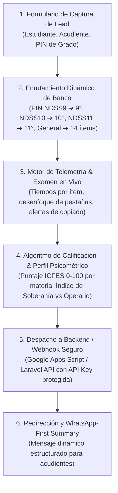
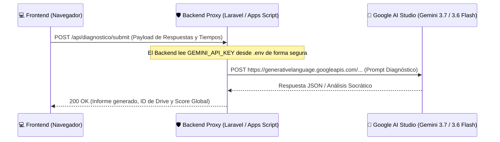

# Arquitectura, Lógica y Código de Referencia: Batería Diagnóstica NDSS CogniFlight
**Ruta de Producción en Vivo:** `https://inteligencia-educativa-ndss.web.app/diagnostico`  
**Ecosistema:** Nova Digital Studio Systems (NDSS) • CogniFlight  
**Propósito:** Guía técnica y código de referencia para desarrolladores e integradores de plataforma.

---

## 1. Visión General del Sistema

La **Batería Diagnóstica de Fricción Cognitiva** es una Single-Page Application (SPA) de alto rendimiento diseñada para medir no solo si el estudiante responde correctamente, sino **cómo piensa bajo presión**.



---

## 2. Seguridad Inquebrantable: Protección de la API Key de Google AI Studio

> [!IMPORTANT]
> **Principio de Seguridad de Nivel Servidor:**  
> La API Key de Google AI Studio **JAMÁS** debe incluirse en el frontend (HTML, JavaScript cliente, Vue, React o Next.js del lado del cliente). El frontend únicamente envía el payload de respuestas y telemetría a un **Endpoint / Webhook de Backend**, y es el backend quien invoca a Gemini utilizando variables de entorno protegidas (`.env` en Laravel/Node o `PropertiesService` en Google Apps Script).

### Diagrama del Patrón Proxy Seguro (Backend):



---

## 3. Modelo de Datos de las Preguntas (JSON Schema)

Cada reactivo del banco de preguntas se estructura con metadatos curriculares, opciones y comentarios pedagógicos:

```json
{
  "id": "MAT-09-001",
  "numero": 1,
  "materia": "Matemáticas",
  "componente": "Numérico - Variacional",
  "competencia": "Razonamiento y Argumentación",
  "enunciado": "¿Cuál de las siguientes opciones representa un número irracional?",
  "opciones": {
    "A": "√9",
    "B": "3/4",
    "C": "-5",
    "D": "√2"
  },
  "clave": "D",
  "explicaciones_distractores": {
    "A": { "perfil": "Operario", "detalle": "Confunde la raíz con un irracional sin simplificar √9 = 3." },
    "B": { "perfil": "Operario", "detalle": "Identifica fracción racional exacta pero no busca irracional." },
    "C": { "perfil": "Cínico", "detalle": "Elige entero negativo por descarte erróneo." },
    "D": { "perfil": "Soberano", "detalle": "Deduce correctamente que √2 posee expansión infinita no periódica." }
  },
  "requiereJustificacion": true
}
```

---

## 4. Código Fuente de Referencia del Motor Frontend

A continuación se presentan los módulos clave en JavaScript nativo que implementan la lógica de la batería:

### A. Selector y Enrutamiento por PIN de Grado
```javascript
const PINS_POR_GRADO = {
  '9': ['NDSS9', 'NOVENO9', 'SABER9', 'PRE9', 'VIP9', 'DANNA9', 'COL9'],
  '10': ['NDSS10', 'DECIMO10', 'SABER10', 'PRE10', 'VIP10', 'VALENTINA10', 'COL10'],
  '11': ['NDSS11', 'ONCE11', 'SABER11', 'PRE11', 'VIP11', 'CALENDARIOB', 'COL11']
};

function validarPinYSeleccionarBanco(pinIngresado) {
  const pinNorm = (pinIngresado || '').trim().toUpperCase();
  
  if (PINS_POR_GRADO['9'].includes(pinNorm)) {
    return { grado: '9', banco: window.BANCO_PREGUNTAS_NOVENO };
  } else if (PINS_POR_GRADO['10'].includes(pinNorm)) {
    return { grado: '10', banco: window.BANCO_PREGUNTAS_DECIMO };
  } else if (PINS_POR_GRADO['11'].includes(pinNorm)) {
    return { grado: '11', banco: window.BANCO_PREGUNTAS_ONCE };
  } else {
    // Si no tiene PIN especial, carga la batería general de 14 preguntas
    return { grado: 'general', banco: PREGUNTAS_GENERAL };
  }
}
```

---

### B. Motor de Telemetría de Fricción Cognitiva & Detección de Foco
```javascript
let desefoquesPestañaCount = 0;
let copyPasteAlerts = 0;
let globalStartTime = null;
let questionStartTime = null;
let tiemposPorPregunta = {};

// 1. Detección de desenfoque de pestaña (cambio a ChatGPT, Google, etc.)
document.addEventListener('visibilitychange', () => {
  if (document.hidden && globalStartTime) {
    desefoquesPestañaCount++;
    console.warn(`[TELEMETRÍA] Pestaña desenfocada. Total incidencias: ${desefoquesPestañaCount}`);
    actualizarBadgeIncidencias();
  }
});

// 2. Control de tiempo por reactivo
function registrarTiempoPregunta(indicePregunta) {
  const ahora = Date.now();
  if (questionStartTime) {
    const duracionSegundos = Math.round((ahora - questionStartTime) / 1000);
    tiemposPorPregunta[indicePregunta] = (tiemposPorPregunta[indicePregunta] || 0) + duracionSegundos;
  }
  questionStartTime = ahora;
}

// 3. Cálculo del Índice de Enfoque (%)
function calcularEnfoqueScore() {
  const totalIncidencias = desefoquesPestañaCount + copyPasteAlerts;
  return Math.max(0, 100 - (totalIncidencias * 10));
}
```

---

### C. Algoritmo de Calificación y Perfil Psicométrico
```javascript
function calcularResultadosDiagnostico(banco, respuestas, justificaciones) {
  let aciertosTotales = 0;
  let puntajeSoberania = 0;
  let puntajeOperario = 0;
  const materias = {};

  banco.forEach((item, idx) => {
    const respuestaDada = respuestas[idx];
    const claveCorrecta = item.clave;
    const materia = item.materia || 'General';

    if (!materias[materia]) {
      materias[materia] = { total: 0, aciertos: 0 };
    }
    materias[materia].total++;

    if (respuestaDada === claveCorrecta) {
      aciertosTotales++;
      materias[materia].aciertos++;
      puntajeSoberania += 3;
    } else {
      puntajeOperario += 1;
    }
  });

  const puntajeGlobal = Math.round((aciertosTotales / banco.length) * 100);
  const enfoqueScore = calcularEnfoqueScore();

  return {
    aciertosTotales,
    totalPreguntas: banco.length,
    puntajeGlobal,
    enfoqueScore,
    puntajeSoberania,
    puntajeOperario,
    desgloseMaterias: materias,
    tiemposPorPregunta,
    justificaciones
  };
}
```

---

### D. Envío Seguro al Backend (Apps Script o Laravel API)
```javascript
async function despacharDiagnosticoABackend(leadData, resultados) {
  const ENDPOINT_BACKEND = 'https://script.google.com/macros/s/AKfycbxUGcndmkIPY-RfyVIPtgxtqH-R0a1Bhv3WW0XBeFUzDGCB-N_v2tA6siMRDN2Z8aVZ0g/exec';

  const payload = {
    tipo: 'SUBMIT_DIAGNOSTICO',
    estudiante: leadData.nombre,
    correoEstudiante: leadData.correoEstudiante,
    correoAcudiente: leadData.correoAcudiente,
    telefonoAcudiente: leadData.telefonoAcudiente,
    colegio: leadData.colegio,
    grado: leadData.grado,
    fecha: new Date().toISOString(),
    resultados: resultados
  };

  try {
    const res = await fetch(ENDPOINT_BACKEND, {
      method: 'POST',
      headers: { 'Content-Type': 'text/plain;charset=utf-8' },
      body: JSON.stringify(payload)
    });
    const data = await res.json();
    console.log('[BACKEND] Diagnóstico procesado con éxito:', data);
    return data;
  } catch (error) {
    console.error('[BACKEND] Error en despacho:', error);
    // Fallback resiliente: no bloquear al usuario
    return { status: 'OFFLINE_FALLBACK' };
  }
}
```

---

### E. Formateador de Mensaje WhatsApp-First para Acudientes
```javascript
function generarEnlaceWhatsApp(leadData, resultados) {
  const telefonoNDSS = '573133741406';
  
  const mensaje = 
`🎯 *REPORTE DE DIAGNÓSTICO COGNITIVO NDSS*
━━━━━━━━━━━━━━━━━━━━
👤 *Estudiante:* ${leadData.nombre}
🏫 *Colegio:* ${leadData.colegio || 'Particular'}
📚 *Grado:* ${leadData.grado}°

📊 *MÉTRICAS DE RENDIMIENTO:*
• *Puntaje Global:* ${resultados.puntajeGlobal}% (${resultados.aciertosTotales}/${resultados.totalPreguntas})
• *Índice de Enfoque:* ${resultados.enfoqueScore}% en pantalla
• *Perfil Dominante:* ${resultados.puntajeSoberania >= resultados.puntajeOperario ? '🛡️ Soberano Intelectual' : '⚙️ En Riesgo de Operario'}

Hola Profesor Jimmy, acabo de completar la Batería Diagnóstica. Deseo conocer el Plan de Choque Táctico personalizado.`;

  return `https://wa.me/${telefonoNDSS}?text=${encodeURIComponent(mensaje)}`;
}
```

---

## 5. Implementación del Backend Seguro (Ejemplo en Laravel / Node.js)

Para que tu colega lo replique en su propio servidor:

```php
<?php
// Controlador en Laravel: DiagnosticController.php

namespace App\Http\Controllers;

use Illuminate\Http\Request;
use Illuminate\Support\Facades\Http;

class DiagnosticController extends Controller
{
    public function store(Request $request)
    {
        $validated = $request->validate([
            'estudiante' => 'required|string',
            'grado' => 'required|string',
            'resultados' => 'required|array'
        ]);

        // 1. Obtener la API Key de forma 100% segura desde el archivo .env del servidor
        $apiKey = config('services.gemini.api_key'); // NUNCA expuesta en el cliente

        // 2. Invocar Gemini 3.7 / 3.6 Flash para redactar el análisis cualitativo
        $response = Http::withHeaders([
            'Content-Type' => 'application/json'
        ])->post("https://generativelanguage.googleapis.com/v1beta/models/gemini-2.5-flash:generateContent?key={$apiKey}", [
            'contents' => [
                [
                    'parts' => [
                        ['text' => "Actúa como Director Pedagógico de NDSS. Analiza estos resultados y genera 3 recomendaciones: " . json_encode($validated['resultados'])]
                    ]
                ]
            ]
        ]);

        $analisisIA = $response->json()['candidates'][0]['content']['parts'][0]['text'] ?? 'Análisis en proceso.';

        // 3. Guardar en base de datos y retornar al cliente
        return response()->json([
            'status' => 'success',
            'analisis' => $analisisIA
        ]);
    }
}
```

---

## 6. Resumen de Buenas Prácticas para la Otra Plataforma

1. **Separación de Responsabilidades:**  
   El frontend gestiona la interactividad, el cronómetro, la prevención de trampas y la experiencia de usuario. El backend gestiona el guardado en base de datos, el envío de correos/PDFs y las llamadas a la Inteligencia Artificial.
2. **Resiliencia Offline / Modo Fallback:**  
   Si el servidor de IA se congestiona (error 429 o 503), el sistema debe calcular las métricas matemáticas estándar (aciertos y enfoque) y entregar el reporte inmediato sin dejar la pantalla congelada.
3. **Escalabilidad de Bancos:**  
   Los bancos de preguntas deben cargarse dinámicamente mediante archivos JSON o tablas en base de datos según el grado seleccionado (`9°`, `10°`, `11°`).
